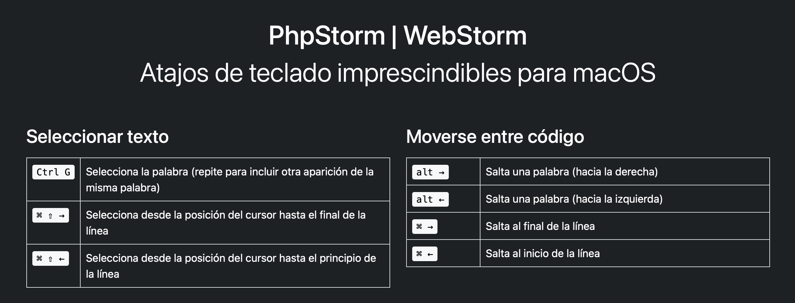

JetBrains - guía básica
=======================

Una **web** sencilla para consultar algunos de los **atajos de teclado** más útiles en **PhpStorm** y **WebStorm** (versión macOS).

Puedes usar esta web **directamente en tu equipo** (no es necesario disponer de servidor web). Simplemente abré el fichero `index.html` con tu navegador.

💡 _Recomendación_: Una vez abierto en el navegador, si quieres puedes guardarte el enlace en tu barra de favoritos. De este modo, con un solo click tendrás siempre a mano el listado de atajos (incluso cuando no estés conectado a Internet).

Proyecto publicado aquí: https://jetbrains.surge.sh  

  

### Dev notes

* Deployed on Surge.sh using GitHub actions
* Using Bootstrap 5 https://getbootstrap.com/docs/5.0/getting-started/introduction/
* Using Bootstrap Icons 1.4.1 https://icons.getbootstrap.com/#icons
